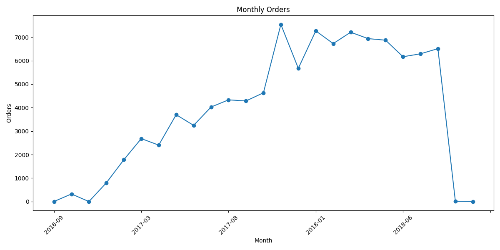
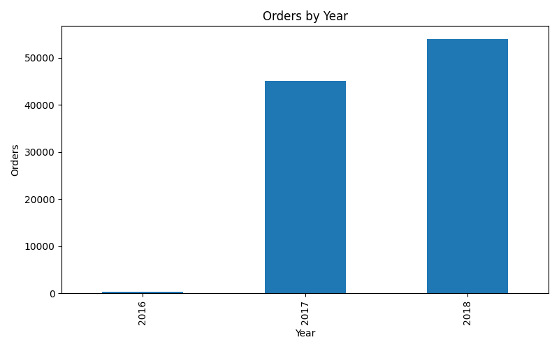
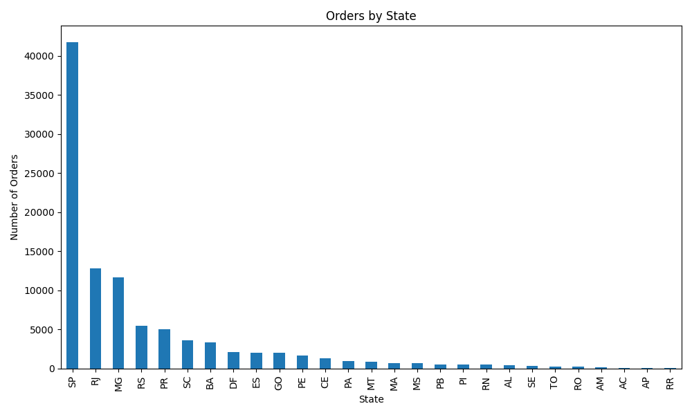
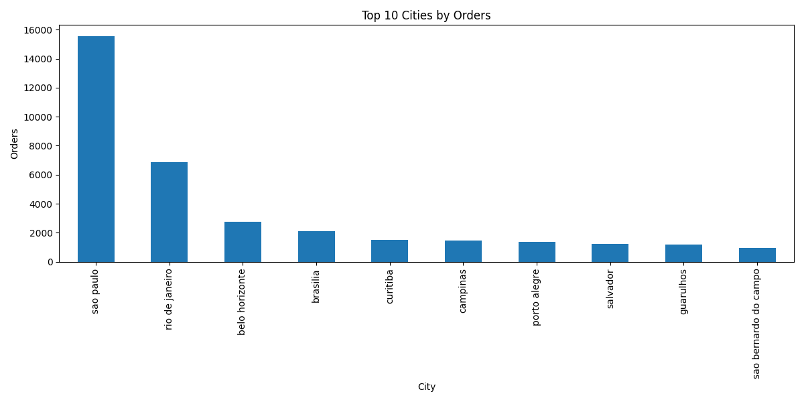
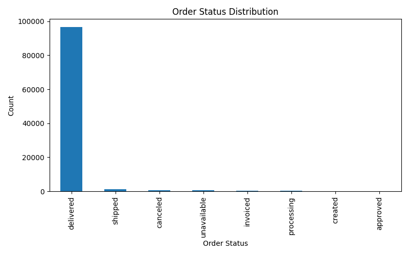
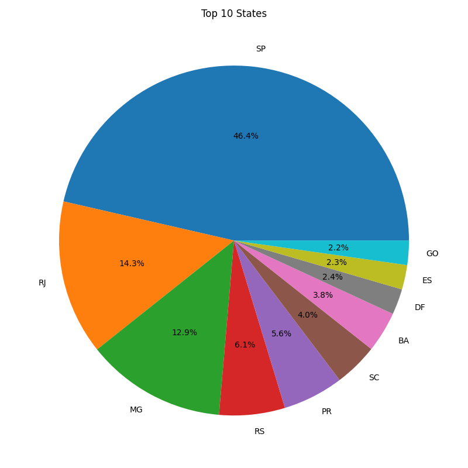

# Data Foundations: SQL Extraction, Cleaning & Outlier Audit

**Capstone:** Part 1  
**Course:** Data Analytics with Gen & Agentic AI  
**Student:** Bhuvaneswari Yennapusala  
**Organization:** Masai School  
**Database:** MySQL running through XAMPP / phpMyAdmin  
**Dataset:** Olist Brazilian E-Commerce Public Dataset

---

## 1. Project Overview

This project implements the complete **Part 1 – Data Foundations: SQL Extraction, Cleaning & Outlier Audit** workflow.

The project uses a relational MySQL database created from the Olist Brazilian E-Commerce dataset. SQL is used for data extraction, filtering, aggregation, JOIN operations, and referential-integrity validation. The required JOIN result is exported to CSV and cleaned using Python/Pandas. Continuous numeric business measures are then audited for outliers using both the **IQR** and **Z-score** methods.

### Main objectives

- Build a two-table-or-more relational database with real primary-key/foreign-key relationships.
- Demonstrate the six required SQL query techniques.
- Perform `GROUP BY` + `HAVING` analysis using multiple aggregate functions.
- Demonstrate both `INNER JOIN` and `LEFT JOIN` with a clear join justification.
- Validate referential integrity using all three required checks.
- Export a JOIN result to CSV.
- Clean the exported CSV using Pandas.
- Report missing-value counts and percentages.
- Apply an explicit and justified imputation strategy.
- Detect and remove duplicate rows.
- Audit continuous numeric business measures using IQR and Z-score.
- Compare the two outlier methods and explain why their results differ.
- Preserve reproducible reports and visual evidence in the repository.

---

## 2. Dataset

### Olist Brazilian E-Commerce Public Dataset

The project uses the public Olist Brazilian E-Commerce dataset.

The relational schema contains:

| Table | Purpose |
|---|---|
| `customers` | Customer information |
| `orders` | Order information |
| `products` | Product information |
| `order_items` | Products contained in orders |
| `payments` | Payment information |
| `reviews` | Customer review information |

The Part 1 workflow primarily uses `customers`, `orders`, `payments`, and `order_items`.

---

## 3. Technology Stack

| Technology | Purpose |
|---|---|
| MySQL | Relational database |
| XAMPP | Local MySQL server environment |
| phpMyAdmin | Database creation, import, query execution and result inspection |
| SQL | Extraction, aggregation, JOINs and integrity checks |
| Python | Data cleaning and outlier analysis |
| Pandas | CSV loading, missing-value analysis and duplicate handling |
| NumPy | Numerical processing |
| SQLAlchemy | Python–MySQL connectivity |
| PyMySQL | MySQL driver |
| Matplotlib | Exploratory visualizations |
| SciPy | Statistical-analysis dependency |
| Git/GitHub | Version control and submission |

---

# 4. Repository Structure

```text
Data-Foundations-SQL-Extraction-Cleaning-Outlier-Audit/
│
├── database/
│   ├── 01_schema.sql
│   └── 02_import_data.sql
│
├── sql/
│   ├── 03_basic_queries.sql
│   ├── 04_groupby_having.sql
│   ├── 05_joins.sql
│   └── 06_integrity_checks.sql
│
├── python/
│   ├── config.py
│   ├── export_csv.py
│   ├── data_cleaning.py
│   ├── outlier_analysis.py
│   └── generate_visualizations.py
│
├── data/
│   ├── raw/
│   └── cleaned/
│       └── cleaned_orders.csv
│
├── output/
│   └── reports/
│       ├── orders_customers_join.csv
│       ├── data_cleaning_report.txt
│       ├── outlier_analysis_report.txt
│       └── visualization_report.txt
│
├── images/
│   ├── monthly_orders.png
│   ├── orders_by_year.png
│   ├── orders_by_state.png
│   ├── top10_cities.png
│   ├── order_status_distribution.png
│   └── top_states_pie.png
│
├── requirements.txt
├── LICENSE
└── README.md
```

---

# 5. Database Design

Database name:

```text
smartcommerce_analytics
```

The schema uses **InnoDB**, explicit primary keys, and foreign-key constraints.

## Primary Keys

| Table | Primary Key |
|---|---|
| `customers` | `customer_id` |
| `orders` | `order_id` |
| `products` | `product_id` |
| `order_items` | `(order_id, order_item_id)` |
| `payments` | `(order_id, payment_sequential)` |
| `reviews` | `review_id` |

## Foreign Keys

| Child table | Foreign key | Parent |
|---|---|---|
| `orders` | `customer_id` | `customers(customer_id)` |
| `order_items` | `order_id` | `orders(order_id)` |
| `order_items` | `product_id` | `products(product_id)` |
| `payments` | `order_id` | `orders(order_id)` |
| `reviews` | `order_id` | `orders(order_id)` |

The schema explicitly defines `FOREIGN KEY` constraints with `ON UPDATE CASCADE` and `ON DELETE RESTRICT`.

### Relationship overview

```text
customers (1) ───────< orders (M)
orders    (1) ───────< order_items (M)
products  (1) ───────< order_items (M)
orders    (1) ───────< payments (M)
orders    (1) ───────< reviews (M)
```

**Important data note:** the schema supports the `customers → orders` 1:M relationship, but in this particular Olist `customer_id` extraction each customer record is associated with one order. Therefore, the Task 5 grouped validation query returned no customer with more than one order. The README reports the observed result rather than claiming a multi-order result that was not present.

---

# 6. Part 1 Task-by-Task Implementation

## Task 1 – Relational Database Setup

### Requirement

Create a relational database with:

- at least two related tables
- explicit primary key
- explicit foreign key
- a real enforced relationship in the schema

### Implementation

Files:

```text
database/01_schema.sql
database/02_import_data.sql
```

The schema creates:

```text
smartcommerce_analytics
```

and defines six tables with primary and foreign keys.

The tables use the InnoDB storage engine, and foreign keys are explicitly declared.

### Result

**PASS – relational schema created with explicit PK/FK constraints.**

---

# 7. Task 2 – Six Required SQL Query Types

File:

```text
sql/03_basic_queries.sql
```

The file contains all six required techniques.

| Query type | Implementation |
|---|---|
| `WHERE ... IN` | Finds delivered/shipped orders |
| `WHERE ... NOT IN` | Filters products outside selected categories |
| `BETWEEN` | Filters orders by purchase-date range |
| `ORDER BY` | Sorts using two columns with DESC/ASC directions |
| Subquery | `NOT EXISTS` identifies customers without orders |
| `LIKE` | Performs partial text matching using `%paulo%` |

### Query 1 – IN

```sql
WHERE order_status IN ('delivered','shipped')
```

### Query 2 – NOT IN

```sql
WHERE product_category_name NOT IN (...)
```

### Query 3 – BETWEEN

```sql
WHERE order_purchase_timestamp
BETWEEN '2018-01-01' AND '2018-12-31'
```

### Query 4 – ORDER BY

```sql
ORDER BY price DESC,
         freight_value ASC
```

This satisfies the two-column sorting requirement with both ascending and descending directions.

### Query 5 – Subquery

```sql
WHERE NOT EXISTS (
    SELECT 1
    FROM orders o
    WHERE o.customer_id = c.customer_id
)
```

### Query 6 – LIKE

```sql
WHERE customer_city LIKE '%paulo%'
```

### Result

**PASS – all six required SQL query types are present in one SQL file.**

---

# 8. Task 3 – GROUP BY + HAVING

File:

```text
sql/04_groupby_having.sql
```

The query groups payment records by payment type.

It uses all three required aggregate functions:

```sql
COUNT(*)
SUM(payment_value)
AVG(payment_value)
```

and filters groups using:

```sql
HAVING SUM(p.payment_value) > 100000
```

It also orders the resulting groups by total sales.

### Result columns

```text
payment_type
total_transactions
total_sales
average_payment
```

### Result

**PASS – GROUP BY + HAVING is implemented with multiple aggregate functions.**

---

# 9. Task 4 – INNER JOIN and LEFT JOIN

File:

```text
sql/05_joins.sql
```

Tables:

```text
customers
orders
```

## INNER JOIN

The INNER JOIN returns only records where `customer_id` exists in both tables.

Purpose:

- retrieve customers who have matching orders
- combine customer information with order information

```sql
FROM customers AS c
INNER JOIN orders AS o
ON c.customer_id = o.customer_id
```

## LEFT JOIN

The LEFT JOIN keeps every customer from the left-hand `customers` table.

Purpose:

- preserve all customer records
- identify customers without matching orders through NULL order columns

```sql
FROM customers AS c
LEFT JOIN orders AS o
ON c.customer_id = o.customer_id
```

### Join justification

**INNER JOIN:** used when only matched customer-order records are required.

**LEFT JOIN:** used when every customer must be retained, including customers with no matching order.

### Result

**PASS – both required JOIN types are implemented and justified.**

---

# 10. Task 5 – Referential Integrity Validation

File:

```text
sql/06_integrity_checks.sql
```

The validation uses all three required checks.

## Check 1 – COUNT(DISTINCT)

```sql
COUNT(DISTINCT c.customer_id)
```

This verifies how many distinct customers have matching orders.

### Observed result

```text
unique_customers_with_orders = 99,441
```

## Check 2 – Grouped child count

```sql
SELECT
    o.customer_id,
    COUNT(o.order_id) AS total_orders
FROM orders AS o
GROUP BY o.customer_id
HAVING COUNT(o.order_id) > 1
```

This checks whether any parent customer has more than one matching child order.

### Observed result

```text
0 rows
```

Therefore, no customer in this loaded Olist extraction has more than one order under the `customer_id` key.

## Check 3 – Orphan check

```sql
SELECT
    o.order_id,
    o.customer_id
FROM orders AS o
LEFT JOIN customers AS c
ON o.customer_id = c.customer_id
WHERE c.customer_id IS NULL
```

### Observed result

```text
0 rows
```

Therefore, no orphan orders were found.

### Task 5 conclusion

```text
Distinct customers with matching orders : 99,441
Customers with >1 order                 : 0
Orphan orders                            : 0
```

The foreign-key relationship is defined in the database schema, and the SQL validation confirms that the loaded data contains no orphan orders.

### Result

**PASS – all three required referential-integrity queries are implemented and executed successfully.**

---

# 11. Task 6 – Export JOIN Result to CSV

File:

```text
python/export_csv.py
```

The Task 4 customer-order JOIN result is exported using Pandas.

### Output

```text
output/reports/orders_customers_join.csv
```

### Exported columns

```text
customer_id
customer_city
customer_state
order_id
order_status
order_purchase_timestamp
```

### Export result

| Metric | Result |
|---|---:|
| Rows | 99,441 |
| Columns | 6 |
| Output format | CSV |

### Result

**PASS – JOIN result exported successfully and used as the input to Task 7.**

---

# 12. Task 7 – Data Cleaning with Pandas

File:

```text
python/data_cleaning.py
```

Input:

```text
output/reports/orders_customers_join.csv
```

Output:

```text
data/cleaned/cleaned_orders.csv
```

Report:

```text
output/reports/data_cleaning_report.txt
```

## Missing-value audit

| Column | Missing values | Percentage |
|---|---:|---:|
| `customer_id` | 0 | 0.0% |
| `customer_city` | 0 | 0.0% |
| `customer_state` | 0 | 0.0% |
| `order_id` | 0 | 0.0% |
| `order_status` | 0 | 0.0% |
| `order_purchase_timestamp` | 0 | 0.0% |

### Imputation strategy

The Python script explicitly uses:

- **Categorical/object columns → mode**
- **Numeric columns → median**

Median is preferred over mean because it is less sensitive to extreme values.

For categorical data, mode preserves the most common category.

### Important result

The exported dataset contained **zero missing values**, so the imputation logic was checked but no actual imputation was necessary.

## Duplicate audit

| Metric | Result |
|---|---:|
| Rows before cleaning | 99,441 |
| Rows after cleaning | 99,441 |
| Duplicate rows removed | 0 |
| Missing values after cleaning | 0 |
| Final columns | 6 |

### Result

**PASS – missing-value counts and percentages, explicit imputation logic, duplicate detection, and before/after counts are documented.**

---

# 13. Task 8 – Outlier Audit

File:

```text
python/outlier_analysis.py
```

Report:

```text
output/reports/outlier_analysis_report.txt
```

## Continuous numeric filtering rule

Only continuous numeric business measures are analysed.

The script excludes identifier/key columns, binary/flag-like columns, and zero/near-zero variance columns from the numeric selection process.

The selected business measures are:

```text
price
freight_value
```

The query intentionally loads only these continuous numeric measures from `order_items`, so the selected dataframe contains no ID/date/text columns requiring exclusion.

### Rows analysed

```text
112,650
```

---

## IQR Method

Formula:

```text
IQR = Q3 - Q1

Lower Fence = Q1 - 1.5 × IQR
Upper Fence = Q3 + 1.5 × IQR
```

### Price

| Metric | Value |
|---|---:|
| Q1 | 39.900000 |
| Q3 | 134.900000 |
| IQR | 95.000000 |
| Lower Fence | -102.600000 |
| Upper Fence | 277.400000 |
| IQR Outliers | 8,427 |

### Freight value

| Metric | Value |
|---|---:|
| Q1 | 13.080000 |
| Q3 | 21.150000 |
| IQR | 8.070000 |
| Lower Fence | 0.975000 |
| Upper Fence | 33.255000 |
| IQR Outliers | 12,134 |

---

## Z-score Method

Formula:

```text
Z = (x - mean) / standard deviation
```

An observation is classified as an outlier when:

```text
|Z| > 3
```

### Price

| Metric | Value |
|---|---:|
| Mean | 120.653739 |
| Standard deviation | 183.633928 |
| Threshold | 3 |
| Z-score outliers | 1,966 |

### Freight value

| Metric | Value |
|---|---:|
| Mean | 19.990320 |
| Standard deviation | 15.806405 |
| Threshold | 3 |
| Z-score outliers | 2,041 |

---

## IQR vs Z-score comparison

| Measure | IQR outliers | Z-score outliers | Difference | Result |
|---|---:|---:|---:|---|
| `price` | 8,427 | 1,966 | 6,461 | Disagree |
| `freight_value` | 12,134 | 2,041 | 10,093 | Disagree |

### Why do the methods differ?

IQR is less dependent on the mean and standard deviation and is generally more robust for skewed distributions and extreme values.

Z-score uses the mean and standard deviation and is most appropriate when the distribution is approximately normal.

Therefore, the two methods can classify different observations as outliers, particularly when the data are skewed or contain extreme values.

### Result

**PASS – both required outlier methods are applied to every selected continuous numeric measure, the thresholds are documented, counts are reported, and the methods are compared with an explanation.**

---

# 14. Generated Reports

The repository contains the following evidence files:

| File | Purpose |
|---|---|
| `output/reports/orders_customers_join.csv` | Task 6 JOIN export |
| `output/reports/data_cleaning_report.txt` | Task 7 cleaning evidence |
| `output/reports/outlier_analysis_report.txt` | Task 8 outlier evidence |
| `output/reports/visualization_report.txt` | Visualization summary |

---

# 15. Visual Evidence

The project includes generated Matplotlib visualizations.

### Monthly Orders



### Orders by Year



### Orders by State



### Top 10 Cities



### Order Status Distribution



### Top States



> These plots provide visual evidence of the exploratory outputs generated from the project. Screenshots of phpMyAdmin/terminal execution are not required by the Part 1 acceptance criteria because the repository already contains the executable SQL/Python files and generated result reports.

---

# 16. How to Run the Project

## Step 1 – Clone the repository

```bash
git clone https://github.com/iameshureddy/Data-Foundations-SQL-Extraction-Cleaning-Outlier-Audit.git
cd Data-Foundations-SQL-Extraction-Cleaning-Outlier-Audit
```

## Step 2 – Start XAMPP

Open **XAMPP Control Panel** and start:

```text
MySQL
```

Open:

```text
http://localhost/phpmyadmin
```

The Python scripts use:

```text
Host     : localhost
Port     : 3306
User     : root
Password : empty by default in this project
Database : smartcommerce_analytics
```

If the local MySQL password is different, update the database configuration before running the Python scripts.

---

## Step 3 – Install Python dependencies

Recommended:

```bash
python -m pip install -r requirements.txt
```

The repository requirements include:

```text
pandas
numpy
SQLAlchemy
PyMySQL
matplotlib
scipy
```

---

## Step 4 – Create the database schema

Open phpMyAdmin → SQL and execute:

```text
database/01_schema.sql
```

This creates the database, tables, primary keys and foreign keys.

---

## Step 5 – Import the dataset

Execute:

```text
database/02_import_data.sql
```

This loads the Olist data into the relational database.

---

## Step 6 – Run Task 2

Execute:

```text
sql/03_basic_queries.sql
```

---

## Step 7 – Run Task 3

Execute:

```text
sql/04_groupby_having.sql
```

---

## Step 8 – Run Task 4

Execute:

```text
sql/05_joins.sql
```

---

## Step 9 – Run Task 5

Execute:

```text
sql/06_integrity_checks.sql
```

Confirm:

- `COUNT(DISTINCT ...)` returns the expected customer count.
- The grouped child-count query executes successfully.
- The orphan-record query returns zero rows.

---

## Step 10 – Run Task 6

From the project root:

```powershell
python python/export_csv.py
```

Expected output:

```text
output/reports/orders_customers_join.csv
```

---

## Step 11 – Run Task 7

```powershell
python python/data_cleaning.py
```

Expected output:

```text
data/cleaned/cleaned_orders.csv
```

and:

```text
output/reports/data_cleaning_report.txt
```

---

## Step 12 – Run Task 8

```powershell
python python/outlier_analysis.py
```

Expected report:

```text
output/reports/outlier_analysis_report.txt
```

---

## Step 13 – Generate visualizations

```powershell
python python/generate_visualizations.py
```

Generated images are stored in:

```text
images/
```

---

## 17. Part 1 Checklist

The following table summarizes the work completed for Part 1.

| Task | What was completed | File / Output |
|---|---|---|
| Task 1 | Created the relational database with primary and foreign keys | `database/01_schema.sql` |
| Task 2 | Added the required SQL queries: `IN`, `NOT IN`, `BETWEEN`, `ORDER BY`, subquery, and `LIKE` | `sql/03_basic_queries.sql` |
| Task 3 | Created a `GROUP BY` and `HAVING` query using `COUNT`, `SUM`, and `AVG` | `sql/04_groupby_having.sql` |
| Task 4 | Implemented both `INNER JOIN` and `LEFT JOIN` between customers and orders | `sql/05_joins.sql` |
| Task 5 | Checked customer-order relationships using distinct count, grouped count, and orphan-record checks | `sql/06_integrity_checks.sql` |
| Task 6 | Exported the customer-order JOIN result to CSV | `output/reports/orders_customers_join.csv` |
| Task 7 | Loaded the CSV in Pandas, checked missing values, handled duplicates, and saved the cleaned dataset | `python/data_cleaning.py` |
| Task 8 | Analysed `price` and `freight_value` using IQR and Z-score methods | `python/outlier_analysis.py` |
| Reports | Generated cleaning and outlier-analysis reports | `output/reports/` |
| Visualizations | Generated charts for order trends and distributions | `images/` |
| Documentation | Added setup, execution steps, results, and project details | `README.md` |

---

# 18. Final Verified Results

## Task 5

```text
Unique customers with orders : 99,441
Customers with >1 order      : 0 rows
Orphan orders                : 0 rows
```

## Task 6

```text
Rows exported    : 99,441
Columns exported: 6
```

## Task 7

```text
Rows before cleaning : 99,441
Rows after cleaning  : 99,441
Duplicates removed   : 0
Missing values       : 0
Columns              : 6
```

## Task 8

```text
price
    IQR outliers     : 8,427
    Z-score outliers : 1,966

freight_value
    IQR outliers     : 12,134
    Z-score outliers : 2,041
```

---

# 19. Key Learning Outcomes

This Part 1 project demonstrates:

- relational database design
- primary and foreign keys
- SQL filtering
- subqueries
- pattern matching
- sorting
- aggregation
- `GROUP BY` and `HAVING`
- `INNER JOIN`
- `LEFT JOIN`
- referential-integrity validation
- CSV data export
- Pandas data cleaning
- missing-value analysis
- imputation strategy
- duplicate detection
- IQR outlier detection
- Z-score outlier detection
- comparison of statistical methods
- reproducible reporting
- Git/GitHub-based project delivery

---

# 20. Submission

### Public GitHub Repository

https://github.com/iameshureddy/Data-Foundations-SQL-Extraction-Cleaning-Outlier-Audit

The repository contains:

- SQL schema and data-import scripts
- all required SQL query files
- Python CSV-export script
- Python data-cleaning script
- Python outlier-analysis script
- exported CSV
- cleaned CSV
- cleaning report
- outlier report
- visualization report
- generated visualizations
- this README

---

## Final Status

**Part 1 – Data Foundations: SQL Extraction, Cleaning & Outlier Audit**

**Implementation status: COMPLETE**

The repository documents the required SQL extraction, relational JOINs, referential-integrity checks, CSV export, Pandas cleaning workflow, and IQR/Z-score outlier audit together with reproducible outputs and visual evidence.
